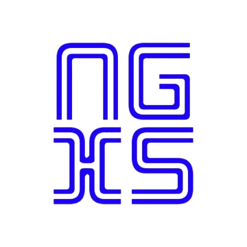

# NGXS Course
This repository was created for students of the course:
"Deep Dive into NGXS with Angular 17"

 
For each topic (video) there are <b>2</b> separate branches: with the working and the solution environments. For example:

<b>1). lesson-2.1/installation-ngxs/workplace</b> - the starting point at which the video author begins recording the lesson. This branch is needed to repeat the actions of the author.
 
<b>2). lesson-2.1/installation-ngxs/solution</b> - the end point that the author of the video came to during the lesson. This branch is needed to see the solution/result.

## Run servers
### To run the Backend Server
    json-server --port 3000 ./src/assets/mock/db/db.json

Index:

    http://localhost:3000

Endpoints:

    http://localhost:3000/tasks
    http://localhost:3000/users

### To run the Dev UI Server
    ng serve

Index:

    http://localhost:4200

## Author's environment:
- Angular CLI: 17.3.4   
- RxJs: 7.8.1  
- TypeScript: 5.3.3  
- Node: 20.10.0  
- Package Manager: npm 10.2.3  
- OS: win32 x64
